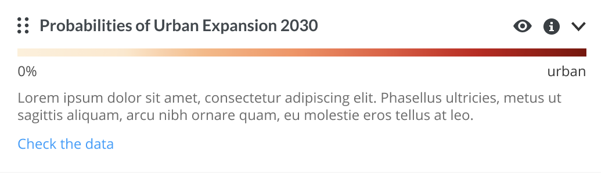

# Front-end-code-challenge

## Objective
To complete this code challenge, you will need to develop a simple React-based web application, containing the Legend component. In the real world scenario, this component would be a part of a more extensive flow on the map, but for the recruitment purpose, you will focus only this bit.

#### DATA
The sample legend data, located in the `data.json` file, describe the items of the legend component. It should be fetched dynamically (like would you do if it was data from a REST API). You can use directly this url if you want `https://raw.githubusercontent.com/Vizzuality/front-end-code-challenge/feature/readme/data.json`

Each legend item has:
- `id`: a unique identifier
- `name`: the name of the layer
- `type`: a type of the item (basic, choropleth or gradient)
- `items`: an array of objects having name and color values
- `description`: data to be displayed in a modal.

#### DESIGNS
Designs are stored in Figma. You should create an account to be able to see them.

- https://www.figma.com/file/CcReFFvkqC2FZoCi8yiGhb/Code-Challenge?node-id=0%3A1 Here you can inspect every single component of the legend
- https://www.figma.com/proto/CcReFFvkqC2FZoCi8yiGhb/Code-Challenge?node-id=1%3A415&scaling=min-zoom Here you can see the legend working

#### ICONS
All the icons required are stored in this repo, check `assets/icons`. Feel free to add them as you desire.

## Basic requirements:
Create 3 different legend item components: basic, choropleth and gradient. Timeline is optional

`basic`

`choropleth`

`gradient`

`timeline` (optional)
If you are not going to do this layer, please filter it out from the data response.

Create the toolbar component which contains 3 different buttons, each of them has a tooltip with short-name:

`info button`
  - tooltip short name: "Layer Info"
  - a click opens a modal that displays the content from the `description` field. Please consider that some of the values are HTML string and they need to be parsed.
  - expose a function called `onChangeInfo`

`visibility button`
  - tooltip short name: "Hide layer" / "Show layer"
  - a click changes the icon and the tooltip name
  - expose a function called `onChangeVisibility`

`collapse button`
  - tooltip short name: "Collapse layer" / "Expand layer"
  - a click collapses the legend item and shows only the title of the component. It also changes the tooltip name
  - expose a function called `onChangeCollapse`

## Optional goals:
If you found the basic requirements too easy, you can always try to implement something extra:

**1)** It seems that the client wants to put a text inside the first layer (see screenshot). Could you add it and make it scalable for future changes?

**2)** It seems that the client wants to be able to sort the layers. As he have a handler designed on the right of each layer item, could you add a functionality of drag and drop to be able to sort the layers? Also, you should expose a function `onChangeOrder` with the new ids sorted.

**3)** You may noticed that there are 4 layers inside the `data.json`. The last one has a timeline config with the following values
- `step`: it defines how many steps you should increase each time
- `speed`: it defines the changing velocity of the step (Only if we animate it)
- `dateFormat`: it defines the format you should show for the dates inside the legend
- `maxDate`: Max date
- `minDate`: Min date

We think that with these values you should be able to represent this timeline. You can change the `startDate` and `endDate`. Remember to expose a function `onChangeDate` with the new dates defined by the range.

## Technical requirements
There are a few rules that we would like you to follow during your code challenge:
  - Use the React library to demonstrate component-oriented architecture,
  - Style your components, use an approach that you see fit,
  - Take care of mobile devices and make sure that your project works on smaller resolution screens,
  - Work closely with the design, try to implement it as accurately as possible

For sharing purposes please create a **new GitHub repo**, deploy your project to the **GitHub pages** and provide the link to the repo.

Your submission should also include a readme file, where you can document your work, describe the features and the architectural decisions that you made. Feel free to share there your thoughts about the challenges that you faced implementing this code.

## What’s next?
Once you submit your solution, our developers will review your code challenge, taking your experience level into account. The sample code provided by you should be in a state considered as a "production" ready - where each requested element is prepared and potentially ready to review with your colleagues.

Here are a few hints that can help to align your code with the requirements:
- Does the application realize all the required features?
- Is anything missing from the specification?

- Is the code clear, maintainable, and easy to understand for other developers? Is it extendable?
- Is it responsive? Does it scale on mobile devices easily?
- Does the readme file describes all the features and covers all the information that is essential for the project?
- Don’t focus only on the “happy path” - have you covered all the edge cases that you faced?
